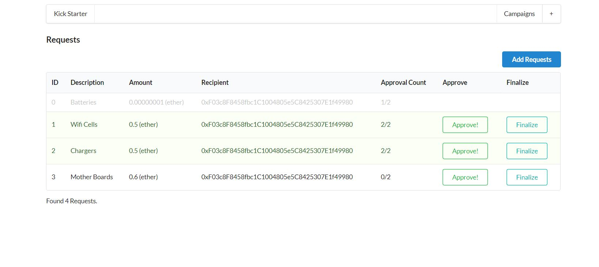

<h1 style = "text-align:center;">Kick Start Project</h1>
<h3>Problem Definition</h3>

From A point of View kick-start has the problem that some malicious users can create campaigns and then take the supporter's money and run away with it ..

<h3>Problem Solution</h3>

we Can make use of Blockchain (smart contracts ) to prevent malicious users from that by making the supporters approve first on a request by the manager of the campaign and 51% of the supporters should approve on that request first

 
 
<h3>Project Intro</h3>

This Project Aims to slove the problem of kick-start using the following tools 
<ol>
<li>Ethereum Smart Contracts(Solidity) as the Backbone and the server side of our Application</li>
<li>React js as The front-end technology for our Application</li>
<li>Web3.js as a Bridge from ethereum world to the web world</li>
<li>Next.js as routing handler and a built-in routing module as dynamic routing solution</li>
<li>Meta-mask Chrome extension to handle Transactions Approvers and Rejection</li>
</ol>

<h5>To Test the project</h5>
<ol><li>You can use remix editor and run using the following address   
0x67C745392B98F15bBA0B464f5ea6ba561de584C3
 
<b>You should use Compiler Version : 4.17+</b>
</li>
 
<li>You Cand Clone This Repo and Run The Following</li>
<ol><li>npm install</li>
<li>npm run test <b>: To run the unit Testing</b>
<li>Npm run dev <b>: you should find it running on localhost:3000</b></li></li>
</ol>
<b>Note : you should install nodejs first</b>
</ol>

Some Screens
 

 
 
<ol><li>

List of All Campaigns

    

</li>
<li>

Create New Campaign

</li>

<li>
    
Verify 0 Ether Transaction to Create the new Campaign

    
    

</li>

<li>
    
View Campaign Details

    
    

</li>

<li>
    
Requests Details

    
    

</li>

<li>
    
Making a New Request

    
    

</li>
</ol>

Notes :
<ol><li>
I've Used Rinkeby Network as  A Testing Environment for My Application</li>

<li>I have used infura to get a running node on the Rinkeby Network</li></ol>
